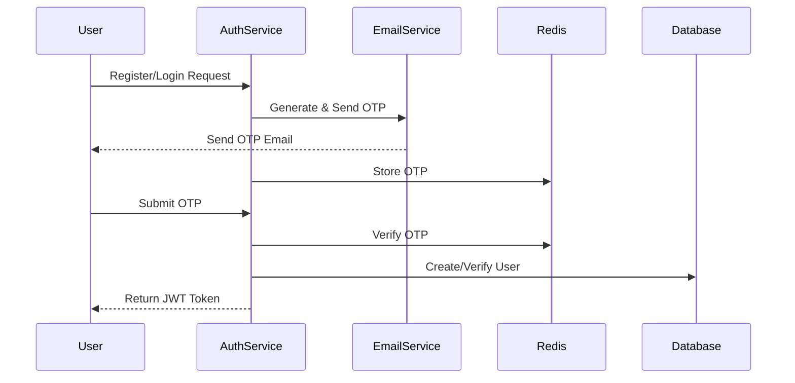
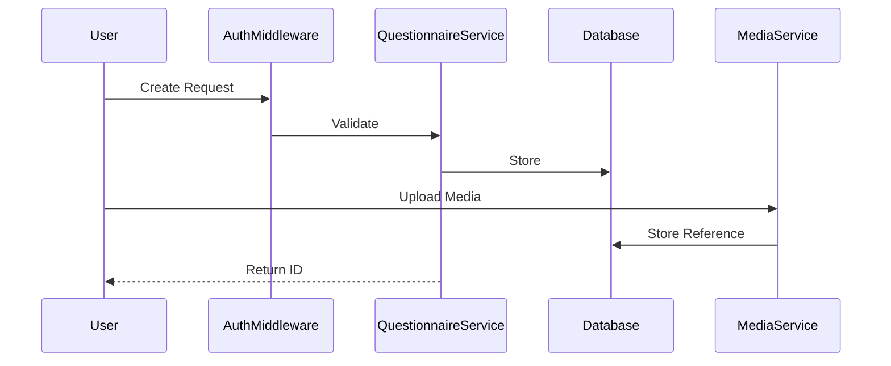
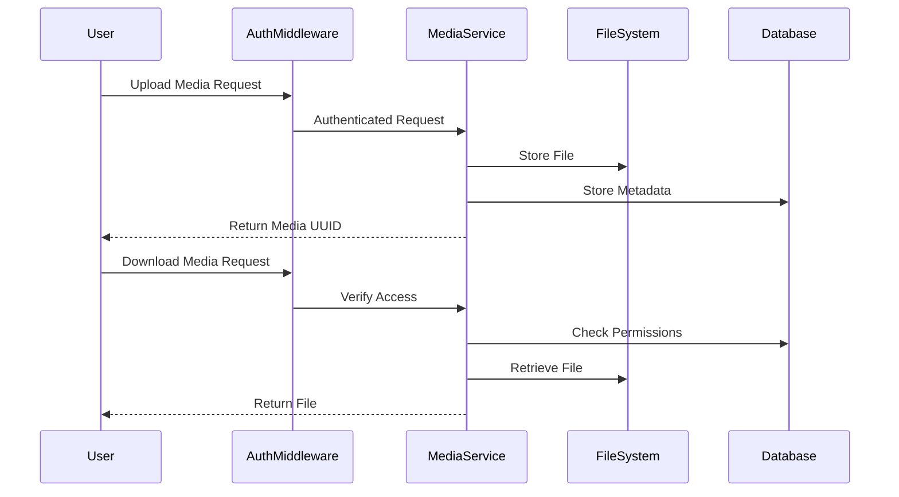
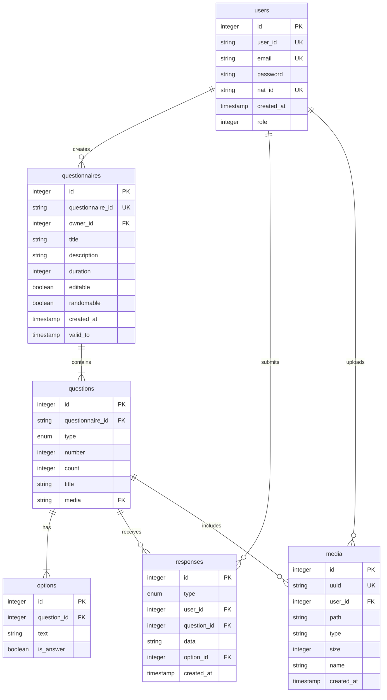

# Questionnaire System

A robust questionnaire management system built with Go, featuring secure authentication, questionnaire creation and management, response collection, and file handling capabilities.

## Table of Contents
- [Architecture Overview](#architecture-overview)
- [System Design](#system-design)
  - [Data Flow Diagrams](#data-flow-diagrams)
  - [Entity Relationship Diagram](#entity-relationship-diagram)
- [Technical Stack](#technical-stack)
- [Features](#features)
- [Setup Instructions](#setup-instructions)
- [API Documentation](#api-documentation)

## Architecture Overview

The project follows a Clean Architecture pattern with Domain-Driven Design (DDD) principles, organized in the following layers:

1. **Domain Layer** (`internal/*/domain`)
   - Contains business logic and domain models
   - Defines core business rules and entities
   - Independent of external concerns

2. **Port Layer** (`internal/*/port`)
   - Defines interfaces for external dependencies
   - Maintains separation between domain and infrastructure
   - Contains repository interfaces and service contracts

3. **Service Layer** (`internal/*/service`)
   - Implements business use cases
   - Orchestrates domain objects
   - Maintains business rules integrity

4. **Infrastructure Layer** (`pkg/adapter`)
   - Implements external interfaces (database, email, etc.)
   - Handles technical concerns
   - Contains concrete implementations of port interfaces

5. **API Layer** (`api/handler`)
   - Handles HTTP requests and responses
   - Implements REST endpoints
   - Manages request validation and response formatting

### Key Design Patterns Used

1. **Repository Pattern**
   - Abstracts data persistence operations
   - Enables swapping of data storage implementations
   - Centralizes data access logic

2. **Middleware Pattern**
   - Handles cross-cutting concerns
   - Manages authentication and authorization
   - Implements rate limiting

## System Design

### Data Flow Diagrams

#### Authentication Flow


#### Questionnaire Management Flow


#### Media Handling Flow


### Entity Relationship Diagram



## Technical Stack

- **Language**: Go 1.23
- **Web Framework**: Fiber
- **Database**: MySQL
- **Cache**: Redis
- **Authentication**: JWT + OTP
- **Containerization**: Docker + Docker Compose

## Implemented Features

1. **Authentication System**
   - Two-factor authentication with email OTP
   - JWT-based session management
   - Secure password hashing

2. **Rate Limiting**
   - IP-based rate limiting for API endpoints
   - Configurable request limits

3. **Questionnaire Management**
   - Create and manage questionnaires
   - Support for multiple question types
   - Option management for questions

4. **Media Handling**
   - Secure file upload and storage
   - Access control for media files
   - Support for various file types

5. **Response Management**
   - Store and manage questionnaire responses
   - Support for different response types

## Setup Instructions

### Prerequisites
- Docker and Docker Compose
- Git

### Quick Start

1. Clone the repository:
```bash
git clone https://github.com/your-repo/questionnaire
cd questionnaire
```

2. Run the application:
```bash
docker-compose up
```

That's it! The application will automatically:
- Start MySQL and Redis services
- Wait for databases to be ready
- Run database migrations
- Start the application server

The application will be available at `http://localhost:3000`

### Environment

All necessary configurations are already set in:
- `config.json`: Database, Redis, and email configurations
- `Private_key.pem`: JWT signing key
- `Public_key.pem`: JWT verification key

## API Documentation

### Authentication Endpoints

- `POST /api/v1/auth/register/init`: Initialize registration
- `POST /api/v1/auth/register/complete`: Complete registration
- `POST /api/v1/auth/login/init`: Initialize login
- `POST /api/v1/auth/login/complete`: Complete login

### Questionnaire Endpoints

- `POST /api/v1/questionnaire`: Create questionnaire
- `POST /api/v1/questionnaire/questions`: Add questions
- `GET /api/v1/questionnaire/:id`: Get questionnaire
- `PUT /api/v1/questionnaire/:id`: Update questionnaire
- `DELETE /api/v1/questionnaire/:id`: Delete questionnaire

### Media Endpoints

- `POST /api/v1/media/upload`: Upload media
- `GET /api/v1/media/download/:uuid`: Download media

## Error Handling

The application uses standardized error responses:

```json
{
    "error": {
        "message": "Error description"
    }
}
```

Common HTTP status codes:
- `400`: Bad Request
- `401`: Unauthorized
- `403`: Forbidden
- `404`: Not Found
- `429`: Too Many Requests
- `500`: Internal Server Error